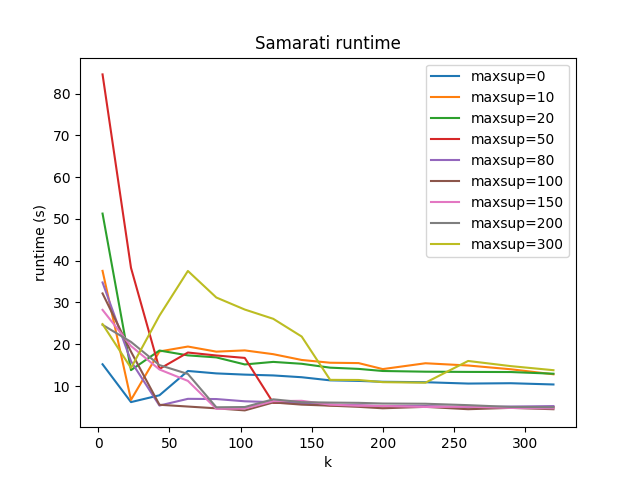
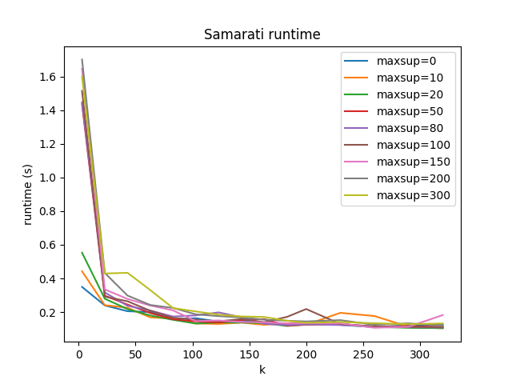
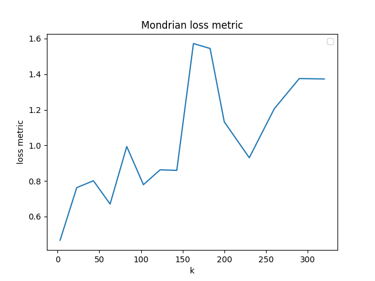

# K-Anonimato, algoritmi Samarati e Mondrian

## Dataset

- [adult.data](https://archive.ics.uci.edu/ml/datasets/adult)

  Gli attributi sono: 'age', 'work_class', 'final_weight', 'education', 'education_num', 'marital_status', 'occupation', 'relationship', 'race', 'sex', 'capital_gain', 'capital_loss', 'hours_per_week', 'native_country', and 'class'.

- adult\_\*.txt: ci sono 2 stringhe in ogni riga, separate da una virgola. Quella a sinistra rappresenta il nodo figlio, e quella a destra il nodo genitore, servono a formare le gerarchie per l'esecuzione dell'algoritmo Samarati per il k-anonimato.

- [bank.csv](https://archive.ics.uci.edu/dataset/222/bank+marketing)

  Gli attributi sono: 'age', 'job', 'marital', 'education', 'default', 'balance', 'housing', 'loan', 'contact', 'day', 'month', 'duration', 'campaign', 'pdays', 'previous', 'poutcome', 'y'


- bank\_\*.txt: ci sono 2 stringhe in ogni riga, separate da una virgola. Quella a sinistra rappresenta il nodo figlio, e quella a destra il nodo genitore, servono a formare le gerarchie per l'esecuzione dell'algoritmo Samarati per il k-anonimato.

## Algoritmi

### Samarati

[samarati.py](algorithms/samarati.py) e [samarati_bank.py](algorithms/samarati_bank.py).

### Mondrian

[mondrian.py](algorithms/mondrian.py) e [mondrian_bank.py](algorithms/mondrian_bank.py).

## Parametri

### Adult

Parametri consigliati per eseguire samarati sul dataset adult sono: k = 10 e maxsup = 20:

```bash
python main.py --samarati --k 10 --maxsup 20
```

Parametri consigliati per eseguire mondrian sul dataset adult sono: k = 10:

```bash
python main.py --mondrian --k 10
```

### Bank

Inserisci parametri bank
Parametri consigliati per eseguire samarati sul dataset bank sono: k = 3:

```bash
python main.py --samarati --k 3
```

Parametri consigliati per eseguire mondrian sul dataset bank sono: k = 3:

```bash
python main.py --mondrian --k 3
```

Le configurazioni si trovano in `default_data_config` e `default_data_configB` rispettivamente in [utils/data_loader](utils/data_loader.py) e [utils/data_loader_bank](utils/data_loader_bank.py), mentre i risultati sono salvati nella directory [results](./results/) 

## Programma:

- algorithms:
  - [samarati.py](algorithms/samarati.py)
  - [mondrian.py](algorithms/mondrian.py)
  - [samarati_bank.py](algorithms/samarati_bank.py)
  - [mondrian_bank.py](algorithms/mondrian_bank.py)
- data: dataset e potenziali gerarchie di generalizzazione
  - [adult.data](data/adult.data): dataset Adult sorgente;
  - [bank.csv](data/bank.csv): dataset Bank sorgente;
  - [gerarchie adult\_\*](data): gerarchie del dataset Adult;
  - [gerarchie bank\_\*](data): gerarchie del dataset Bank.
- results: directory dove vengono salvate le tabelle anonimizzate e la tabella originaria
  - [risultati Mondrian](./results/mondrian.csv)
  - [risultati Samarati](./results/samarati.csv)
  - [tabella originale](./results/original.csv)
- utils:
  - caricatore dati
    - [data loader adult](utils/data_loader.py)
    - [data loader bank](utils/data_loader_bank.py)
  - metriche di perdita
    - [loss metric adult](utils/loss_metrics_adult.py)
    - [loss metric bank](utils/loss_metrics_bank.py)
- [main.py](main.py)
- [plot.py](plot.py)


### Plotting

Grafo tra relazioni di tempo di esecuzione e metrica di perdita in base ai diversi k maxsup scelti per testare gli algoritmi Samarati e Mondrian:

- `k_s_full = list(range(3, 200, 20)) + list(range(200, 350, 30))`
- `maxsup_full = [0, 10, 20, 50, 80, 100, 150, 200, 300]`

```bash
python plot.py --samarati
python plot.py --mondrian
```

## Risultati

### Esecuzione di Samarati base (vanilla) per il database Adult:

```bash
python main.py --samarati --k 10 --maxsup 20
```

```
configuration:
 {'k': 10, 'maxsup': 20, 'samarati': True, 'mondrian': False, 'bank': False, 'data': {'path': 'data/adult.data', 'samarati_quasi_id': ['age', 'gender', 'race', 'marital_status'], 'mondrian_quasi_id': ['age', 'education_num'], 'sensitive': 'occupation', 'columns': ['age', 'work_class', 'final_weight', 'education', 'education_num', 'marital_status', 'occupation', 'relationship', 'race', 'gender', 'capital_gain', 'capital_loss', 'hours_per_week', 'native_country', 'class'], 'samarati_generalization_type': {'age': 'range', 'gender': 'categorical', 'race': 'categorical', 'marital_status': 'categorical'}, 'hierarchies': {'age': None, 'gender': 'data/adult_gender.txt', 'race': 'data/adult_race.txt', 'marital_status': 'data/adult_marital_status.txt'}, 'mondrian_generalization_type': {'age': 'numerical', 'education_num': 'numerical'}}}     

row count before sanitizing: 32561
row count sanitized: 30162

hierarchies:
 {'age': {'39': '(35, 40)', '50': '(50, 55)', '38': '(35, 40)', '53': '(50, 55)', '28': '(25, 30)', '37': '(35, 40)', '49': '(45, 50)', '52': '(50, 55)', '31': '(30, 35)', '42': '(40, 45)', '30': '(30, 35)', '23': '(20, 25)', '32': '(30, 35)', '34': '(30, 35)', '25': '(25, 30)', '43': '(40, 45)', '40': '(40, 45)', '54': '(50, 55)', '35': '(35, 40)', '59': '(55, 60)', '56': '(55, 60)', '19': '(15, 20)', '20': '(20, 25)', '45': '(45, 50)', '22': '(20, 25)', '48': '(45, 50)', '21': '(20, 25)', '24': '(20, 25)', '57': '(55, 60)', '44': '(40, 45)', '41': '(40, 45)', '29': '(25, 30)', '47': '(45, 50)', '46': '(45, 50)', '36': '(35, 40)', '79': '(75, 80)', '27': '(25, 30)', '18': '(15, 20)', '33': '(30, 35)', '76': '(75, 80)', '55': '(55, 60)', '61': '(60, 65)', '70': '(70, 75)', '64': '(60, 65)', '71': '(70, 75)', '66': '(65, 70)', '51': '(50, 55)', '58': '(55, 60)', '26': '(25, 30)', '17': '(15, 20)', '60': '(60, 65)', '90': '(90, 95)', '75': '(75, 80)', '65': '(65, 70)', '77': '(75, 80)', '62': '(60, 65)', '63': '(60, 65)', '67': '(65, 70)', '74': '(70, 75)', '72': '(70, 75)', '69': '(65, 70)', '68': '(65, 70)', '73': '(70, 75)', '81': '(80, 85)', '78': '(75, 80)', '88': '(85, 90)', '80': '(80, 85)', '84': '(80, 85)', '83': '(80, 85)', '85': '(85, 90)', '82': '(80, 85)', '86': '(85, 90)', '(35, 40)': '(30, 40)', '(50, 55)': '(50, 60)', '(25, 30)': '(20, 30)', '(45, 50)': '(40, 50)', '(30, 35)': '(30, 40)', '(40, 45)': '(40, 50)', '(20, 25)': '(20, 30)', '(55, 60)': '(50, 60)', '(15, 20)': '(10, 20)', '(75, 80)': '(70, 80)', '(60, 65)': '(60, 70)', '(70, 75)': '(70, 80)', '(65, 70)': '(60, 70)', '(90, 95)': '(90, 100)', '(80, 85)': '(80, 90)', '(85, 90)': '(80, 90)', '(30, 40)': '(20, 40)', '(50, 60)': '(40, 60)', '(20, 30)': '(20, 40)', '(40, 50)': '(40, 60)', '(10, 20)': '(0, 20)', '(70, 80)': '(60, 80)', '(60, 70)': '(60, 80)', '(90, 100)': '(80, 100)', '(80, 90)': '(80, 100)', '(20, 40)': '*', '(40, 60)': '*', '(0, 20)': '*', '(60, 80)': '*', '(80, 100)': '*'}, 'gender': {'Female': '*', 'Male': '*'}, 'race': {'Other': '*', 'Amer-Indian-Eskimo': '*', 'Black': '*', 'White': '*', 'Asian-Pac-Islander': '*'}, 'marital_status': {'NM': '*', 'Married': '*', 'leave': '*', 'alone': '*', 'Never-married': 'NM', 'Married-civ-spouse': 'Married', 'Married-AF-spouse': 'Married', 'Divorced': 'leave', 'Separated': 'leave', 'Widowed': 'alone', 'Married-spouse-absent': 'alone'}}

hierarchy heights:
 {'age': 4, 'gender': 1, 'race': 1, 'marital_status': 2}

leaves_num:
 {'age': {'(35, 40)': 5, '(50, 55)': 5, '(25, 30)': 5, '(45, 50)': 5, '(30, 35)': 5, '(40, 45)': 5, '(20, 25)': 5, '(55, 60)': 5, '(15, 20)': 3, '(75, 80)': 5, '(60, 65)': 5, '(70, 75)': 5, '(65, 70)': 5, '(90, 95)': 1, '(80, 85)': 5, '(85, 90)': 3, '(30, 40)': 10, '(50, 60)': 10, '(20, 30)': 10, '(40, 50)': 10, '(10, 20)': 3, '(70, 80)': 10, '(60, 70)': 10, '(90, 100)': 1, '(80, 90)': 8, '(20, 40)': 20, '(40, 60)': 20, '(0, 20)': 3, '(60, 80)': 20, '(80, 100)': 9, '*': 72}, 'gender': {'*': 2}, 'race': {'*': 5}, 'marital_status': {'*': 7, 'NM': 1, 'Married': 2, 'leave': 2, 'alone': 2}}

loss_metric_map:
 {'age': {'*': 1, '39': 0, '50': 0, '38': 0, '53': 0, '28': 0, '37': 0, '49': 0, '52': 0, '31': 0, '42': 0, '30': 0, '23': 0, '32': 0, '34': 0, '25': 0, '43': 0, '40': 0, '54': 0, '35': 0, '59': 0, '56': 0, '19': 0, '20': 0, '45': 0, '22': 0, '48': 0, '21': 0, '24': 0, '57': 0, '44': 0, '41': 0, '29': 0, '47': 0, '46': 0, '36': 0, '79': 0, '27': 0, '18': 0, '33': 0, '76': 0, '55': 0, '61': 0, '70': 0, '64': 0, '71': 0, '66': 0, '51': 0, '58': 0, '26': 0, '17': 0, '60': 0, '90': 0, '75': 0, '65': 0, '77': 0, '62': 0, '63': 0, '67': 0, '74': 0, '72': 0, '69': 0, '68': 0, '73': 0, '81': 0, '78': 0, '88': 0, '80': 0, '84': 0, '83': 0, '85': 0, '82': 0, '86': 0, '(35, 40)': 0.056338028169014086, '(50, 55)': 0.056338028169014086, '(25, 30)': 0.056338028169014086, '(45, 50)': 0.056338028169014086, '(30, 35)': 0.056338028169014086, '(40, 45)': 0.056338028169014086, '(20, 25)': 0.056338028169014086, '(55, 60)': 0.056338028169014086, '(15, 20)': 0.028169014084507043, '(75, 80)': 0.056338028169014086, '(60, 65)': 0.056338028169014086, '(70, 75)': 0.056338028169014086, '(65, 70)': 0.056338028169014086, '(90, 95)': 0.0, '(80, 85)': 0.056338028169014086, '(85, 90)': 0.028169014084507043, '(30, 40)': 0.1267605633802817, '(50, 60)': 0.1267605633802817, '(20, 30)': 0.1267605633802817, '(40, 50)': 0.1267605633802817, '(10, 20)': 0.028169014084507043, '(70, 80)': 0.1267605633802817, '(60, 70)': 0.1267605633802817, '(90, 100)': 0.0, '(80, 90)': 0.09859154929577464, '(20, 40)': 0.2676056338028169, '(40, 60)': 0.2676056338028169, '(0, 20)': 0.028169014084507043, '(60, 80)': 0.2676056338028169, '(80, 100)': 0.11267605633802817}, 'gender': {'*': 1, 'Female': 0, 'Male': 0}, 'race': {'*': 1, 'Other': 0, 'Amer-Indian-Eskimo': 0, 'Black': 0, 'White': 0, 'Asian-Pac-Islander': 0}, 'marital_status': {'*': 1, 'NM': 0.0, 'Married': 0.16666666666666666, 'leave': 0.16666666666666666, 'alone': 0.16666666666666666, 'Never-married': 0, 'Married-civ-spouse': 0, 'Married-AF-spouse': 0, 'Divorced': 0, 'Separated': 0, 'Widowed': 0, 'Married-spouse-absent': 0}}


metrica di loss: 2.0554451968758376

vettore delle generalizzazioni: (1, 0, 1, 2)

soppressione massima: 7

====================
Tabella:
             age  gender race marital_status         occupation
0      (35, 40)    Male    *              *       Adm-clerical
2      (35, 40)    Male    *              *  Handlers-cleaners
10     (35, 40)    Male    *              *    Exec-managerial
18     (35, 40)    Male    *              *              Sales
22     (35, 40)    Male    *              *    Farming-fishing
...         ...     ...  ...            ...                ...
19045  (80, 85)  Female    *              *      Other-service
19495  (80, 85)  Female    *              *    Exec-managerial
19515  (80, 85)  Female    *              *      Other-service
20482  (80, 85)  Female    *              *       Adm-clerical
26731  (80, 85)  Female    *              *     Prof-specialty

[30155 rows x 5 columns]
====================
```

### Esecuzione di Samarati base (vanilla) per il database Bank:

```bash
python .\main.py --samarati --k 3 --maxsup 10 --bank
```

```
configuration:
 {'k': 3, 'maxsup': 10, 'samarati': True, 'mondrian': False, 'bank': True, 'data': {'path': 'data/bank.csv', 'samarati_quasi_id': ['age', 'job'], 'mondrian_quasi_id': ['age', 'job'], 'sensitive': 'balance', 'columns': ['age', 'job', 'marital', 'education', 'default', 'balance', 'housing', 'loan', 'contact', 'day', 'month', 'duration', 'campaign', 'pdays', 'previous', 'poutcome', 'y'], 'samarati_generalization_type': {'age': 'range', 'job': 'categorical'}, 'hierarchies': {'age': None, 'job': 'data/bank_job.txt'}, 'mondrian_generalization_type': {'age': 'numerical', 'job': 'categorical'}}}

row count before sanitizing: 4520
row count sanitized: 4520

hierarchies:
 {'age': {'33': '(30, 35)', '35': '(35, 40)', '30': '(30, 35)', '59': '(55, 60)', '36': '(35, 40)', '39': '(35, 40)', '41': '(40, 45)', '43': '(40, 45)', '20': '(20, 25)', '31': '(30, 35)', '40': '(40, 45)', '56': '(55, 60)', '37': '(35, 40)', '25': '(25, 30)', '38': '(35, 40)', '42': '(40, 45)', '44': '(40, 45)', '26': '(25, 30)', '55': '(55, 60)', '67': '(65, 70)', '53': '(50, 55)', '68': '(65, 70)', '32': '(30, 35)', '49': '(45, 50)', '78': '(75, 80)', '23': '(20, 25)', '52': '(50, 55)', '34': '(30, 35)', '61': '(60, 65)', '45': '(45, 50)', '48': '(45, 50)', '57': '(55, 60)', '54': '(50, 55)', '63': '(60, 65)', '51': '(50, 55)', '29': '(25, 30)', '50': '(50, 55)', '27': '(25, 30)', '60': '(60, 65)', '28': '(25, 30)', '21': '(20, 25)', '58': '(55, 60)', '22': '(20, 25)', '46': '(45, 50)', '24': '(20, 25)', '77': '(75, 80)', '75': '(75, 80)', '47': '(45, 50)', '70': '(70, 75)', '65': '(65, 70)', '64': '(60, 65)', '62': '(60, 65)', '66': '(65, 70)', '19': '(15, 20)', '81': '(80, 85)', '83': '(80, 85)', '80': '(80, 85)', '71': '(70, 75)', '72': '(70, 75)', '69': '(65, 70)', '79': '(75, 80)', '73': '(70, 75)', '86': '(85, 90)', '74': '(70, 75)', '76': '(75, 80)', '87': '(85, 90)', '84': '(80, 85)', '(30, 35)': '(30, 40)', '(35, 40)': '(30, 40)', '(55, 60)': '(50, 60)', '(40, 45)': '(40, 50)', '(20, 25)': '(20, 30)', '(25, 30)': '(20, 30)', '(65, 70)': '(60, 70)', '(50, 55)': '(50, 60)', '(45, 50)': '(40, 50)', '(75, 80)': '(70, 80)', '(60, 65)': '(60, 70)', '(70, 75)': '(70, 80)', '(15, 20)': '(10, 20)', '(80, 85)': '(80, 90)', '(85, 90)': '(80, 90)', '(30, 40)': '(20, 40)', '(50, 60)': '(40, 60)', '(40, 50)': '(40, 60)', '(20, 30)': '(20, 40)', '(60, 70)': '(60, 80)', '(70, 80)': '(60, 80)', '(10, 20)': '(0, 20)', '(80, 90)': '(80, 100)', '(20, 40)': '*', '(40, 60)': '*', '(60, 80)': '*', '(0, 20)': '*', '(80, 100)': '*'}, 'job': {'white-collar': ' employed', 'blue-collar': ' blue-collar', 'self-employed': ' self-employed', 'admin.': ' white-collar', 'unknown': ' other', 'unemployed': ' other', 'management': ' white-collar', 'housemaid': ' blue-collar', 'entrepreneur': ' self-employed', 'student': ' other', 'retired': ' other', 'technician': ' blue-collar', 'services': ' blue-collar'}}

hierarchy heights:
 {'age': 4, 'job': 0}

leaves_num:
 {'age': {'(30, 35)': 5, '(35, 40)': 5, '(55, 60)': 5, '(40, 45)': 5, '(20, 25)': 5, '(25, 30)': 5, '(65, 70)': 5, '(50, 55)': 5, '(45, 50)': 5, '(75, 80)': 5, '(60, 65)': 5, '(70, 75)': 5, '(15, 20)': 1, '(80, 85)': 4, '(85, 90)': 2, '(30, 40)': 10, '(50, 60)': 10, '(40, 50)': 10, '(20, 30)': 10, '(60, 70)': 10, '(70, 80)': 10, '(10, 20)': 1, '(80, 90)': 6, '(20, 40)': 20, '(40, 60)': 20, '(60, 80)': 20, '(0, 20)': 1, '(80, 100)': 6, '*': 67}, 'job': {' employed': 2, 'employed': 1, ' white-collar': 2, ' other': 4, ' blue-collar': 4, ' self-employed': 2}}

loss_metric_map:
 {'age': {'*': 1, '33': 0, '35': 0, '30': 0, '59': 0, '36': 0, '39': 0, '41': 0, '43': 0, '20': 0, '31': 0, '40': 0, '56': 0, '37': 0, '25': 0, '38': 0, '42': 0, '44': 0, '26': 0, '55': 0, '67': 0, '53': 0, '68': 0, '32': 0, '49': 0, '78': 0, '23': 0, '52': 0, '34': 0, '61': 0, '45': 0, '48': 0, '57': 0, '54': 0, '63': 0, '51': 0, '29': 0, '50': 0, '27': 0, '60': 0, '28': 0, '21': 0, '58': 0, '22': 0, '46': 0, '24': 0, '77': 0, '75': 0, '47': 0, '70': 0, '65': 0, '64': 0, '62': 0, '66': 0, '19': 0, '81': 0, '83': 0, '80': 0, '71': 0, '72': 0, '69': 0, '79': 0, '73': 0, '86': 0, '74': 0, '76': 0, '87': 0, '84': 0, '(30, 35)': 0.06060606060606061, '(35, 40)': 0.06060606060606061, '(55, 60)': 0.06060606060606061, '(40, 45)': 0.06060606060606061, '(20, 25)': 0.06060606060606061, '(25, 30)': 0.06060606060606061, '(65, 70)': 0.06060606060606061, '(50, 55)': 0.06060606060606061, '(45, 50)': 0.06060606060606061, '(75, 80)': 0.06060606060606061, '(60, 65)': 0.06060606060606061, '(70, 75)': 0.06060606060606061, '(15, 20)': 0.0, '(80, 85)': 0.045454545454545456, '(85, 90)': 0.015151515151515152, '(30, 40)': 0.13636363636363635, '(50, 60)': 0.13636363636363635, '(40, 50)': 0.13636363636363635, '(20, 30)': 0.13636363636363635, '(60, 70)': 0.13636363636363635, '(70, 80)': 0.13636363636363635, '(10, 20)': 0.0, '(80, 90)': 0.07575757575757576, '(20, 40)': 0.2878787878787879, '(40, 60)': 0.2878787878787879, '(60, 80)': 0.2878787878787879, '(0, 20)': 0.0, '(80, 100)': 0.07575757575757576}, 'job': {'*': 1, 'white-collar': 0, 'blue-collar': 0, 'self-employed': 0, 'admin.': 0, 'unknown': 0, 'unemployed': 0, 'management': 0, 'housemaid': 0, 'entrepreneur': 0, 'student': 0, 'retired': 0, 'technician': 0, 'services': 0}}


metrica di loss: 0.28933360150172577

vettore delle generalizzazioni: (3, 0)

soppressione massima: 6

====================
Tabella:
            age       job balance
0     (20, 40)  services    4789
9     (20, 40)  services    9374
18    (20, 40)  services     132
38    (20, 40)  services     363
65    (20, 40)  services     338
...        ...       ...     ...
1680  (60, 80)   unknown     300
3876  (60, 80)   unknown     367
3962  (60, 80)   unknown    7337
4037  (60, 80)   unknown     353
4224  (60, 80)   unknown    4717

[4514 rows x 3 columns]
====================
```

### Esecuzione di Mondrian per il database Adult:

```bash
python main.py --mondrian
```

```
configuration:
 {'k': 10, 'maxsup': 20, 'samarati': False, 'mondrian': True, 'bank': False, 'data': {'path': 'data/adult.data', 'samarati_quasi_id': ['age', 'gender', 'race', 'marital_status'], 'mondrian_quasi_id': ['age', 'education_num'], 'sensitive': 'occupation', 'columns': ['age', 'work_class', 'final_weight', 'education', 'education_num', 'marital_status', 'occupation', 'relationship', 'race', 'gender', 'capital_gain', 'capital_loss', 'hours_per_week', 'native_country', 'class'], 'samarati_generalization_type': {'age': 'range', 'gender': 'categorical', 'race': 'categorical', 'marital_status': 'categorical'}, 'hierarchies': {'age': None, 'gender': 'data/adult_gender.txt', 'race': 'data/adult_race.txt', 'marital_status': 'data/adult_marital_status.txt'}, 'mondrian_generalization_type': {'age': 'numerical', 'education_num': 'numerical'}}}     

row count before sanitizing: 32561
row count sanitized: 30162

====================

metrica di loss: 0.2577096464479936

====================
Tabella:
          age education_num       occupation
209       17           3-7            Sales
262       17           3-7    Other-service
271       17           3-7    Other-service
335       17           3-7    Other-service
371       17           3-7    Other-service
...      ...           ...              ...
20483  74-90         15-16   Prof-specialty
21473  74-90         15-16   Prof-specialty
21835  74-90         15-16  Exec-managerial
23868  74-90         15-16  Exec-managerial
28176  74-90         15-16  Exec-managerial

[30162 rows x 3 columns]
====================
```

### Esecuzione di Mondrian per il database Bank:

```bash
python main.py --mondrian --bank
```

```
configuration:
 {'k': 10, 'maxsup': 20, 'samarati': False, 'mondrian': True, 'bank': True, 'data': {'path': 'data/bank.csv', 'samarati_quasi_id': ['age', 'job'], 'mondrian_quasi_id': ['age', 'job'], 'sensitive': 'balance', 'columns': ['age', 'job', 'marital', 'education', 'default', 'balance', 'housing', 'loan', 'contact', 'day', 'month', 'duration', 'campaign', 'pdays', 'previous', 'poutcome', 'y'], 'samarati_generalization_type': {'age': 'range', 'job': 'categorical'}, 'hierarchies': {'age': None, 'job': 'data/bank_job.txt'}, 'mondrian_generalization_type': {'age': 'numerical', 'job': 'categorical'}}}

row count before sanitizing: 4520
row count sanitized: 4520

====================

metrica di loss: 0.16187029719369647

====================
Tabella:
         age    job  balance
116   22-24    0-1     4111
270   22-24    0-1      174
444   22-24    0-1     1222
773   22-24    0-1      111
1003  22-24    0-1      204
...     ...    ...      ...
3876  58-71  10-11      367
3962  58-71  10-11     7337
4037  58-71  10-11      353
4136  58-71  10-11     3940
4224  58-71  10-11     4717

[4520 rows x 3 columns]
====================
```

### Tempo di esecuzione e metrica di Loss

- Dataset Adult:
  - Samarati tempo di esecuzione:
    

  - Mondrian tempo di esecuzione:
    

  - Samarati metrica di loss:
    

  - Mondrian metrica di loss:
    

- Dataset Bank:
  - Samarati tempo di esecuzione:
    

  - Mondrian tempo di esecuzione:
    

  - Samarati metrica di loss:
    

  - Mondrian metrica di loss:
    


## Analisi
Dai dati riportati dall'esecuzione dei vari algoritmi è possibili concludere che per entrambi gli algoritmi e per entrambi i dataset:

- il tempo di esecuzione diminuisce all'aumentare di k
- la metrica di perdita aumenta all'aumentare di k

Inoltre per quanto riguarda l'algoritmo samarati si può dire che:

- aumentando il valore di maxsup i tempi di esecuzione diventano più lunghi e anche la metrica di loss cresce.

Questi risultati sono deducibili in quanto avere un k maggiore porta a una generalizzazione più astratta dei dati dei dataset. Di conseguenza cresce la **metrica di perdita**.

Per quanto riguarda il parametro **k** si può dire che è inversamente proporzionale al tempo di esecuzione (in quanto all'aumentare di k il tempo di esecuzione diminuisce), questo perchè aumenta il numero di tuple distinte che possono essere comprese nei gruppi di generalizzazione, perciò diventa più semplice e veloce trovare generalizzazione che rispettino il vincolo di k-anonimato.

Per quanto riguarda il tempo di esecuzione l'algoritmo samarati con l'aumento della grandezza del parametro di **maxsup** (più tuple vengono soppresse). l'algoritmo terminerà prima poiché trova più rapidamente che non esistono tabelle che soddisfano il k-anonimato.

[[le piccole fluttuazioni nei grafici dell'algoritmo Mondrian potrebbero derivare dall'uso di semi casuali diversi per ogni test]]

[[La metrica di perdita per i dati categorici è (M − 1)/(|A| − 1), dove |A| rappresenta il numero totale di nodi foglia nell'albero di generalizzazione, e M rappresenta il numero di nodi foglia nel sottoalbero radicato in x (valore generalizzato nella tabella anonimizzata)]]

[[Per i dati numerici, supponiamo che il valore di una tupla sia stato generalizzato a un intervallo [L_i, U_i]. Indicando i limiti inferiori e superiori nella tabella per A con L e U, la perdita normalizzata per questa voce è data da (U_i - L_i) / (U - L). (ad esempio, la perdita per [20 - 30] è (30 - 20) / (40 - 20) se il limite superiore e inferiore nell'attributo sono 40 e 20)]]

Può anche essere esgutia l'esecuzione dell'algoritmo Mondrian sui quasi-identificatori categorici, nei file [data_loader.py](utils/data_loader.py) e [data_loader_bank.py](utils/data_loader_bank.py), sono implementati due metodi `preprocess_categorical_column` e `recover_categorical_mondrian`, che convertono i valori categoriali in codifiche numeriche (da 0 a n-1) per poterli gestire nei vari step di generalizzazione.

Ad esempio l'attributo `job` nel dataset `Bank` può assumere i valori `admin., unknown, unemployed, management, housemaid, entrepreneur, student, blue-collar, self-employed, retired, technician, services` che viene codificato come `[0, 1, 2, 3, 4, 5, 6, 7, 8, 9, 10, 11]`, oppure l'attributo `maritial` nel dataset `Bank` può assumere i valori `married, single, divorce` che viene codificato come `[0, 1, 2]`.


## Test di Performance di Accesso

Per valutare l'impatto dell'anonimizzazione sulle prestazioni di accesso ai dati, è stato condotto un test di performance sull'accesso ai dati del database creato in memoria locale. Il test ha permesso di confrontare i tempi di accesso e il numero di righe restituite per query simili su tre tabelle: la tabella originale, la tabella anonimizzata con l'algoritmo Samarati e la tabella anonimizzata con l'algoritmo Mondrian.

### Setup del Test

- Database: con SQLite salvato in memoria
- Dataset: Adult
- Attributo di query d'esempio: 'age'
- Valore di query d'esempio: '39' (o eventualmente un intervallo equivalente per le tabelle anonimizzate)

```
row count before sanitizing: 32561
row count sanitized: 30162

Colonne dei dati originali: Index(['age', 'work_class', 'final_weight', 'education', 'education_num',
       'marital_status', 'occupation', 'relationship', 'race', 'gender',
       'capital_gain', 'capital_loss', 'hours_per_week', 'native_country',
       'class'],
      dtype='object')
Colonne dei dati anonimizzati (Samarati): Index(['age', 'gender', 'race', 'marital_status', 'occupation', 'work_class',
       'final_weight', 'education', 'education_num', 'relationship',
       'capital_gain', 'capital_loss', 'hours_per_week', 'native_country',
       'class'],
      dtype='object')
Colonne dei dati anonimizzati (Mondrian): Index(['age', 'education_num', 'occupation', 'work_class', 'final_weight',
       'education', 'marital_status', 'relationship', 'race', 'gender',
       'capital_gain', 'capital_loss', 'hours_per_week', 'native_country',
       'class'],
      dtype='object')

Prime righe dei dati originali:
   age        work_class  final_weight  education  education_num      marital_status  ...  gender capital_gain capital_loss hours_per_week  native_country  class
0   39         State-gov         77516  Bachelors             13       Never-married  ...    Male         2174            0             40   United-States  <=50K
1   50  Self-emp-not-inc         83311  Bachelors             13  Married-civ-spouse  ...    Male            0            0             13   United-States  <=50K
2   38           Private        215646    HS-grad              9            Divorced  ...    Male            0            0             40   United-States  <=50K
3   53           Private        234721       11th              7  Married-civ-spouse  ...    Male            0            0             40   United-States  <=50K
4   28           Private        338409  Bachelors             13  Married-civ-spouse  ...  Female            0            0             40            Cuba  <=50K

[5 rows x 15 columns]

Prime righe dei dati anonimizzati (Samarati):
        age gender race marital_status         occupation   work_class  ...   relationship capital_gain  capital_loss hours_per_week  native_country  class
0  (35, 40)   Male    *              *       Adm-clerical    State-gov  ...  Not-in-family         2174             0             40   United-States  <=50K
1  (35, 40)   Male    *              *  Handlers-cleaners      Private  ...  Not-in-family            0             0             40   United-States  <=50K
2  (35, 40)   Male    *              *    Exec-managerial      Private  ...        Husband            0             0             80   United-States   >50K
3  (35, 40)   Male    *              *              Sales      Private  ...        Husband            0             0             50   United-States  <=50K
4  (35, 40)   Male    *              *    Farming-fishing  Federal-gov  ...        Husband            0             0             40   United-States  <=50K

[5 rows x 15 columns]

Prime righe dei dati anonimizzati (Mondrian):
     age education_num         occupation work_class  final_weight education marital_status  ...   race  gender capital_gain  capital_loss  hours_per_week  native_country  class
0  17-19           1-7      Other-service    Private        309634      11th  Never-married  ...  White  Female            0             0              22   United-States  <=50K
1  17-19           1-7  Handlers-cleaners    Private         25828      11th  Never-married  ...  White    Male            0             0              16   United-States  <=50K
2  17-19           1-7              Sales    Private        140164      11th  Never-married  ...  White  Female            0             0              40   United-States  <=50K
3  17-19           1-7              Sales    Private         65368      11th  Never-married  ...  White  Female            0             0              12   United-States  <=50K
4  17-19           1-7      Other-service    Private        245918      11th  Never-married  ...  White    Male            0             0              12   United-States  <=50K

[5 rows x 15 columns]

Query sulla tabella originale:
SELECT * FROM original WHERE age = '39'

Query sulla tabella anonimizzata (Samarati):
SELECT * FROM anonymizedS WHERE "age" = "(35, 40)"

Query sulla tabella anonimizzata (Mondrian):
SELECT * FROM anonymizedM WHERE "age" = "39" OR "age" = "38-47" OR "age" = "38-48"

Tempo medio di accesso (tabella originale): 0.0068 secondi
Tempo medio di accesso (tabella anonimizzata con Samarati): 0.0167 secondi
Tempo medio di accesso (tabella anonimizzata con Mondrian): 0.0066 secondi

Numero di righe ritornate (tabella originale): 786
Numero di righe ritornate (tabella anonimizzata con Samarati): 4085
Numero di righe ritornate (tabella anonimizzata con Mondrian): 956
```

### Query Eseguite

1. Tabella originale:
   ```sql
   SELECT * FROM original WHERE age = '39'
  ```
2. Tabella anonimizzata con Samarati:
  ```sql
  SELECT * FROM anonymizedS WHERE "age" = "(35, 40)"
  ```

3. Tabella anonimizzata con Mondrian:
  ```sql
  SELECT * FROM anonymizedM WHERE "age" = "39" OR "age" = "38-47" OR "age" = "38-48"
  ```

### Risultati
  Tempo medio di accesso (tabella originale): 0.0068 secondi
  Tempo medio di accesso (tabella anonimizzata con Samarati): 0.0167 secondi
  Tempo medio di accesso (tabella anonimizzata con Mondrian): 0.0066 secondi

  Numero di righe ritornate (tabella originale): 786
  Numero di righe ritornate (tabella anonimizzata con Samarati): 4085
  Numero di righe ritornate (tabella anonimizzata con Mondrian): 956

- Il tempo di accesso alla tabella anonimizzata con Samarati è circa 2 volte e mezzo più lento rispetto alla tabella originale, mentre l'accesso alla tabella anonimizzata con Mondrian è paragonabile all'originale, la differenza tra i due algoritmi di anonimizzazione è probabilmente data dal fatto che l'anonimizzazione tramite l'algoritmo Mondrian (generalizzazione tramite cluster) permette la suddivisione in maniera più efficiente e quindi vengono analizzate meno tuple.
- Entrambe le tabelle anonimizzate restituiscono più righe rispetto all'originale, a causa della generalizzazione, in particolare l'algoritmo Samarati restituisce circa 5 volte più delle righe rispetto alla tabella originale mentre Mondrian restituisce poche righe in più dell'originale.

Ne ricaviamo che: 
- L'anonimizzazione con Samarati ha un impatto maggiore sia in termini di tempo di accesso che riguardo la precisione dei risultati.
- L'anonimizzazione con Mondrian offre un buon compromesso, mantenendo tempi di accesso simili all'originale e una precisione dei risultati relativamente più alta rispetto a Samarati.

### Risultati

I test di performance hanno prodotto i seguenti risultati:

**Tempi medi di accesso:**
- Tabella originale: 0.0068 secondi
- Tabella anonimizzata con Samarati: 0.0167 secondi
- Tabella anonimizzata con Mondrian: 0.0066 secondi

**Numero di righe restituite:**
- Tabella originale: 786
- Tabella anonimizzata con Samarati: 4085
- Tabella anonimizzata con Mondrian: 956

**Analisi comparativa:**

1. **Efficienza di accesso:**
   L'anonimizzazione mediante l'algoritmo Samarati ha comportato un incremento del tempo di accesso di circa 2.5 volte rispetto alla tabella originale. In contrasto, l'algoritmo Mondrian ha mantenuto tempi di accesso comparabili a quelli della tabella non anonimizzata. Questa diversità può essere attribuita alla diversa struttura di generalizzazione impiegata dai due algoritmi: la generalizzazione basata su cluster di Mondrian consente una partizione più efficiente dei dati che risulta in un numero inferiore di tuple restituite.

2. **Precisione dei risultati:**
   Entrambe le tecniche di anonimizzazione hanno portato a un aumento del numero di righe restituite, fenomeno attribuibile al processo di generalizzazione. Nello specifico, l'algoritmo Samarati ha prodotto un incremento di circa 5 volte nel numero di righe restituite rispetto alla tabella originale, mentre l'algoritmo Mondrian ha generato un aumento più contenuto, prossimo ai valori della tabella non anonimizzata.

In conclusione:

- L'anonimizzazione mediante l'algoritmo Samarati dimostra un impatto significativo sia in termini di efficienza di accesso che di precisione dei risultati. Questo suggerisce che, sebbene possa offrire un elevato livello di privacy, potrebbe comportare compromessi in termini di performance.

- L'algoritmo Mondrian, d'altra parte, presenta un equilibrio più favorevole, mantenendo tempi di accesso paragonabili alla tabella originale e offrendo una precisione dei risultati relativamente più elevata rispetto all'approccio Samarati. Ciò indica che Mondrian potrebbe rappresentare una soluzione più adatta in scenari che richiedono un bilanciamento ottimale tra privacy, efficienza di accesso e accuratezza dei dati.


## Conclusioni
L'esecuzione degli algoritmi di k-anonimato, Samarati e Mondrian, sui dataset Adult e Bank dimostra come entrambi i metodi funzionano efficacemente nell'anonimizzazione dei dati rispettando tutti i vincoli del k-anonimato.

L'analisi delle prestazioni in base a valori scelti di k e maxsup evidenzia che la scelta di questi parametri influenza il trade-off tra anonimato e perdita di dati. Gli algoritmi hanno fornito risultati variabili a seconda delle caratteristiche specifiche dei dataset e dei parametri scelti, indicando l'importanza di una configurazione attenta e mirata a seconda del contesto e allo scenario applicativo.

In conclusione, entrambi gli algoritmi sono buoni strumenti per poter ottenere il k-anonimato, in particolare è bene però evidenziare che l'algoritmo per il k-anonimato Mondrian è più veloce nell'esecuzione dell'algoritmo Samarati e permette di raggiungere una metrica di perdita inferiore.

Per maggiori informazioni consultare il documento PDF [Elaborato K-Anonimato - Molinari Lorenzo](Elaborato-MolinariLorenzo_K_Anonimity.pdf)


## References
1. [1] S. De Capitani di Vimercati et al. “k-Anonymity: From Theory to Applications”. In: Transactions on Data Privacy 16.1 (Jan. 2023), pp. 25–49.
2. [2] Differential privacy. Vol. 2006. ICALP, 2006, pp. 1–12. url: [https://link.springer.com/chapter/10.1007/11787006_1](https://link.springer.com/chapter/10.1007/11787006_1).
3. [3] Ninghui Li, Tiancheng Li, and Suresh Venkatasubramanian. “t-closeness: Privacy beyond k-anonymity and l-diversity”. In: 2007 IEEE 23rd international conference on data engineering. IEEE. 2006, pp. 106–115.
4. [4] Ashwin Machanavajjhala et al. “L-diversity: Privacy beyond k-anonymity.” In: ACM Trans. Knowl. Discov. Data 1.1 (2007), p. 3.
5. [5] P. Samarati. “Protecting Respondents’ Identities in Microdata Release”.In: IEEE Transactions on Knowledge and Data Engineering (TKDE) 13.6 (Nov. 2001), pp. 1010–1027.
6. [6] Per la costruzione di questo studio sull'anonimizzazione dei dati e il K-anonimato mi sono basato sulla struttura e gli algoritmi implementati per K-Anonymity e Data Privacy [https://github.com/ltzheng/data-privacy.git](https://github.com/ltzheng/data-privacy.git) di Longtao Zheng [ltzheng](https://github.com/ltzheng)
